# How to become a node operator

## Overview

> USER AGREEMENT: By using, accessing, or downloading these materials, you acknowledge and agree to the terms and conditions at the LICENSE file, and the terms, cautionary statements and disclaimers throughout this site and associated repositories. If you do not agree, discontinue use immediately.

### Hardware Requirement

The node is expected to run on a Linux environment or a MacOS system with memory of 16GB or higher.

The node has been tested in the envrionment listed below.

* MacOS 10.12.6 ~ 10.14.4, Memory: 16GB, CPU: >2 GHz, Intel Core i5/i7 
* Ubuntu 18.04.02 LTS, Memory: 16GB, CPU: 1.8GHz × 8, Intel Core i7

### Local Installation Checkbox ( related to local machine )
1. [Download the bundle](#1-download-the-bundle)
2. [Infura](#2-setting-up-infura)
    1. Create an account
    1. Create a project and obtain an `[Infura Token]`
3. [Ethereum Account (Suggesting MyEtherWallet)](#3-setting-up-an-ethereum-account)
    1. Create an account `[MyEtherWallet PublicKey]` with `[MyEtherWallet Password]` and obtain `[MyEtherWallet keystore file]`
    1. Import into MetaMask
4. [Local Machine setup](#4-local-machine-setup)
    1. Copy `[My EtherWallet keystore file]` to specified location
    1. Docker
        1. Installed on local machine
        1. Set the environment for Docker as specified

> THIRD PARTY ASPECTS: These materials reference and depend upon multiple layers of third party resources, code, analyzers, and platforms that are operated or provided by others subject to their separate branding and terms, including but not limited to Ethereum, Infura, MetaMask, Solidity, Etherscan, Medium, Github, Oyente, MythX, Securify, Amazon, Linux, Apple, Docker, or others. Displays of third party logos, marks, trade names and service names throughout these materials are for your informational purposes only and do not indicate any form of affiliation or endorsement. We are not a party to and do not warrant, endorse, guarantee, or assume responsibility for any such third party aspects or your use or access thereof.

### [Making your Ethereum Account eligible as a node operator](#making-your-account-eligible-as-a-node-operator)
1. Transfer ether and QSP to `[MyEtherWallet PublicKey]`
1. Stake QSP into `[The Protocol Contract]`
    1. Approving `[The Protocol Contract]` to withdraw funds from you
    1. Initiate `[The Protocol Contract]` to freeze the funds and start staking
1. Set the minimum audit price

### [Spinning up your machine to run as a node](#running-the-node)
1. Set environment variables when using a new terminal
1. Start node
1. Check if run correctly 

### [After running the node for a while](#after-running-the-node-for-a-while-1)
-  Checking how much QSP have you earned 
-  How to unstake your funds (Warning: not eligible to audit anymore)

## Local Installation

### 1. Download the bundle 
Download and decompress the repository from the release. The latest release can be found at the top of the following page:  https://github.com/quantstamp/qsp-protocol-node/releases

*Note: The node version specified in the image below may not be the latest release.*  

In order to download the latest release, unfold the **Assets** section of the latest release.
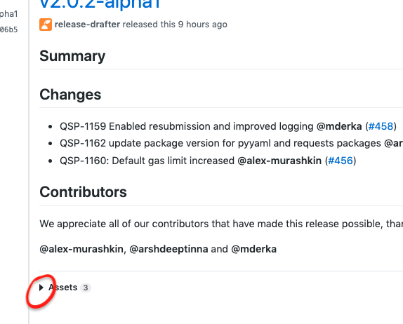

Then click on the zip file as shown in the image below. 

*Note: The version specified in the image below may not be the latest release.*

**Attention!** For easy future access, we recommend you save your quantstamp node directory (the folder that was extracted from the zip file) in your home directory. 

### 2. Setting up Infura ([Click here](https://youtu.be/z-lRuKBimW8) to watch it on Youtube)
You need an Infura account and API token for your node to be able to send transactions to the Ethereum network via the Infura API.
If you already have an Infura API token that you are using elsewhere, we recommend that you create a new token specifically for the node.

1. Visit https://infura.io
1. Login or sign up for an account
1. Create new project
    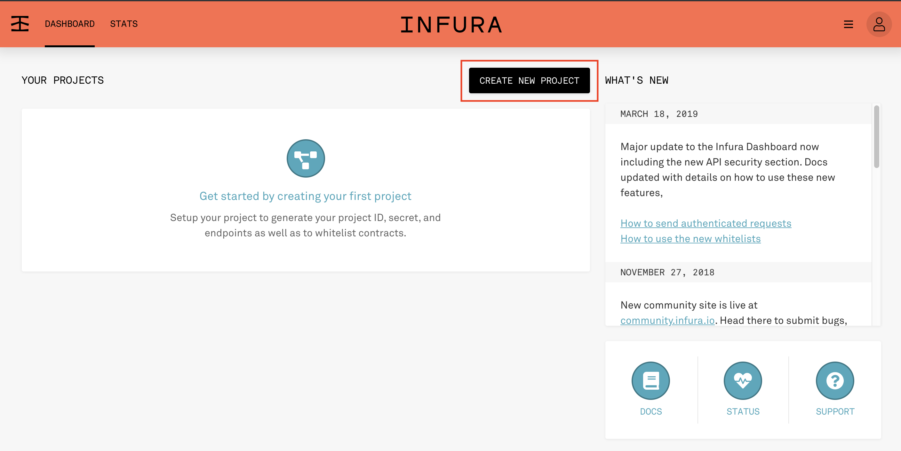

1. Enter project name (we entered "QSP Protocol Node" as an example)
    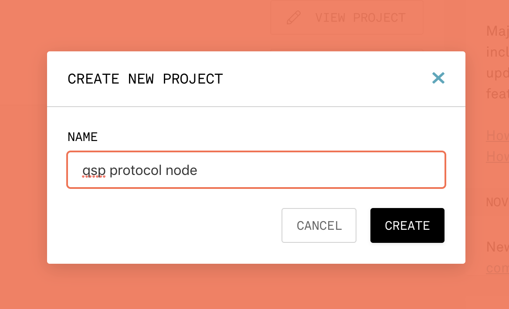
1. After creating the project, you can see it on the dashboard
    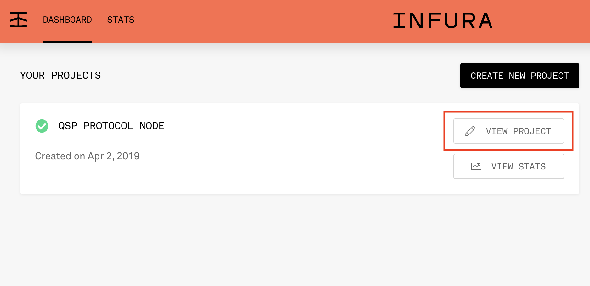

1. Click `VIEW PROJECT`
    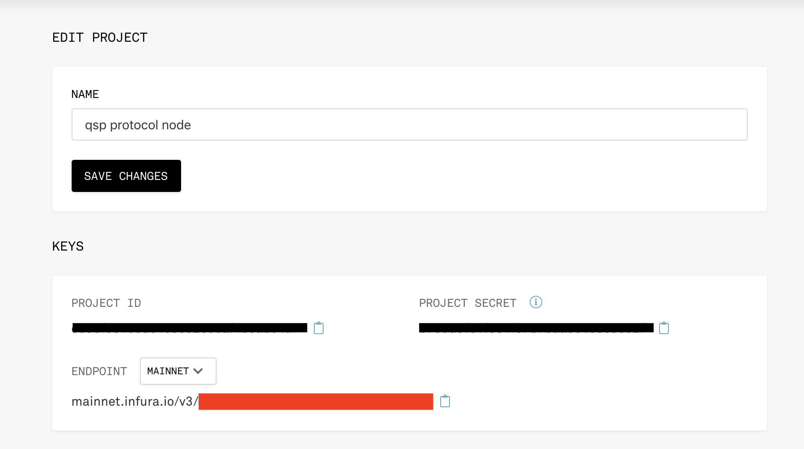

The `Project ID` is your `[Infura Token]`. We will need the `[Infura Token]` again when we set our environment variables in the near future.  

### 3. Setting up an Ethereum account ([Click here](https://youtu.be/9qFOSQxrOaM) to watch it on Youtube)

> IMPORTANT CAUTION: By using these materials, you acknowledge and agree that your interactions are NOT private. These materials enable connectivity to the Ethereum platform, a public blockchain-based distributed computing platform and operating system and thus your interactions, audit node operations, information submitted, analyses, and resulting scan reports are publicly accessible as further described herein. In particular, any of your node information, accounts, amounts, staking, and audit analyses that you generate will be publicly accessible, storable, and stored by one or more entities throughout multiple jurisdictions. If you do not want your information to be publicly accessible, discontinue use immediately.

Your Quantstamp node will need an Ethereum account in order to make transactions on the Ethereum network. The following instructions guide you through creating an account via MyEtherWallet, however, any Ethereum account with a valid keystore file will work fine.

#### Create account via MyEtherWallet
1. Visit https://www.myetherwallet.com
1. Create a new wallet
1. Click the `By Keystore File` option, enter a password for the wallet, then click `Next`
1. After it successfully generated the Keystore File, click on `Download Keystore File`

After the steps above, you should have:
* A password that you created for the keystore, we shall refer to it as `[MyEtherWallet password]`
* A keystore file that allows you to access your account through MyEtherWallet, we shall refer to it as `[MyEtherWallet keystore file]`

*Tip: When you first download your keystore file, rename the file and move it to a location that you will easily find in the future.* 

Now you can try to access your account through MyEtherWallet to read your address.

1. Click `Access My Wallet`
1. Click `Software`
1. Select `Keystore File` and click `Continue`. A dialogue box will pop up. In this dialogue box, select the `[MyEtherWallet keystore file]` you just downloaded.
1. When done, type in `[MyEtherWallet password]`, then click on `"Access Wallet"`.
You should be able to see your account details, your `[Ethereum public address]` is under the `Address`

#### Import account into MetaMask ([Click here](https://www.youtube.com/watch?v=3c_7iu7VKRE&amp=&feature=youtu.be) to watch it on Youtube)
Your node will identify itself to the network via the account that you just created. In order to be
accepted as an auditor, you will need to stake some QSP. The instructions below will show you how to import
the account to MetaMask so that you can stake QSP. 

1. Download MetaMask [here](https://metamask.io/)

1. Open MetaMask and login

    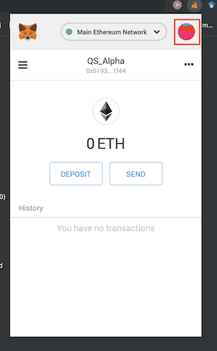

1. Click the upper right circle to browse `My Accounts`

    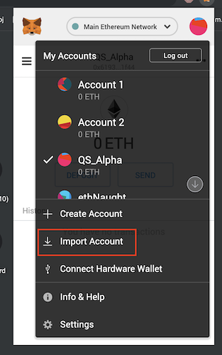

1. Click `Import Account`

    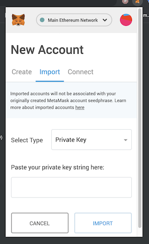

1. Select Type to be `JSON File`, choose the `[MyEtherWallet keystore file]` and enter the `[MyEtherWallet password]`, then click `Import`. When done, you should be able to see that your account has been imported into MetaMask.

    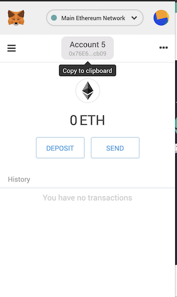
    
*Tip: We recommend naming your MetaMask account QSP Node Operator in order to easily distinguish this account from your other accounts.* 

### 4. Local machine setup
#### Setting up Docker
1. Download the appropriate Docker Community Edition for your computer: https://hub.docker.com/search/?type=edition&offering=community

   Install it according to the instructions.   
   
   Verify: `docker -v` should return Docker version 17.09.0-ce or above

1. ONLY On Linux environments (SKIP this step if you’re using MacOS), check the group owner of /var/run/docker.sock. 

    Run command: `ls -l /var/run/docker.sock` 
    

    The example above shows that the group owner is `staff`

    Run command: `id -nG` to enumerate all the groups for the current user.

1. ONLY On Linux environments (SKIP this step if you’re using MacOS), add the current user to that group (generally docker or root):
`sudo usermod -a -G <group owner of docker.sock> <username>`
This is required for running analyzer containers from the audit node container.
To force the new group assignment to take effect, restart you session (e.g., by logging out and logging in).

#### Copy the `[MyEtherWallet keystore file]` into a specific location
Open both `[MyEtherWallet keystore file]` and `resources/keystore/default.json` in a text editor. Copy the contents of the `[MyEtherWallet keystore file]` and paste it in `resources/keystore/default.json`. You will find `resources/keystore/default.json` in the `qsp_protocol_node` directory that you downloaded and unzipped. 

After you paste the contents of `[MyEtherWallet keystore file]` into `resources/keystore/default.json`, `resources/keystore/default.json` should look something like this: 

*Note: Not all of the code is visible in this image.* 

## Making your account eligible as a node operator ([Click here](https://youtu.be/3EeU_BCqAt0) to watch it on Youtube)
> WARNING: You should conduct your own diligence, exercise caution, and use your best judgment in connection with staking amounts and interacting through use of these materials. Refunds are not available. You may risk loss of QSP, Ether, tokens, or other loss. Features, functionality, schedules, or design architectures are subject to continuing update, modification, cancellation, delay, external dependencies, evolving regulatory frameworks, and/or factors beyond our control and you are cautioned not to place undue reliance on this information. FOR AVOIDANCE OF DOUBT, THE MATERIALS, AND ACCESS AND/OR USAGE THEREOF, INCLUDING ANY ASSOCIATED OR LINKED INFORMATION, SHALL NOT BE CONSIDERED OR RELIED UPON AS ANY MANNER OR FORM OF INVESTMENT, INVESTMENT PURPOSE, VEHICLE WITH AN EXPECTATION TO EARN A PROFIT, OR FINANCIAL, INVESTMENT, TAX, LEGAL, REGULATORY, OR OTHER ADVICE.
### Transfer Ether and QSP to  `[Ethereum public address]`
Your node needs Ether to pay for gas when transacting with the network. We recommend that you transfer a small amount of Ether into the account.
For example, 0.5 ETH would be a fully sufficient amount. We also recommend that you monitor the balance and keep the account above 0.25 ETH.

### Stake QSP into the protocol
Staking freezes some QSP funds from the node's account and makes the node eligible to perform audits.
This is to safeguard the correctness of the produced audit report and disincentivize malicious or negligent behavior on the part of the node operator. 
If your node does not submit correct results, its stake will be slashed.

The staking amount is pre-defined and fixed, currently it is 50,000 QSP.
We will refer to this amount as `[QSP Staking Amount]` later in the document.

There are two steps to stake in the Quantstamp Protocol:
1. The node operator needs to interact with the `[QSP Token Contract]` to approve `[The Protocol Contract]` to withdraw QSP.
1. The node operator will need to tell `[The Protocol Contract]` that the funds are ready to be withdrawn and frozen as a stake.

#### Approve `[The Protocol Contract]` to withdraw QSP from you
In this part, we will be interacting with the `[QSP Token Contract]` to allow staking into `[The Protocol Contract]`. You could interact with the `[QSP Token Contract]` through the website [Etherscan.io](http://etherscan.io).

1. View `[QSP Token Contract]` on Mainnet with MyEtherScan: https://etherscan.io/token/0x99ea4db9ee77acd40b119bd1dc4e33e1c070b80d

1. Navigate to `Write Contract` in the tabs below

    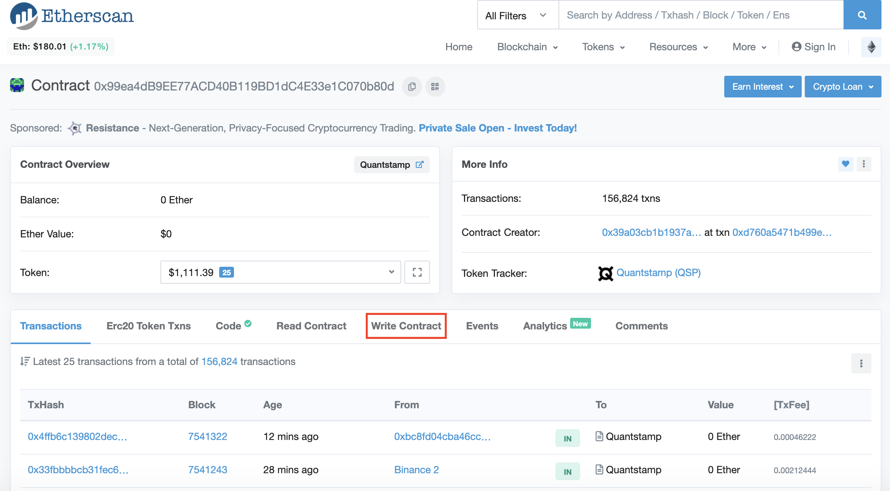

1. If there is a `Connect with Metamask` link next to the text "Write Contract". Click it.

    

1. Approve its request to connect to Metamask

    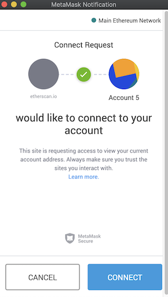

1. You should see a green circle next to the write contract after you connected [Etherscan.io](http://etherscan.io) to your MetaMask.

    

1. Approve the `[The Protocol Contract]` to withdraw minimum [QSP Staking Amount]:

    1. Navigate to the `approve` function
    
        

    1. Fill the field `_spender` with the address of `[The Protocol Contract]`
    
        The address of `[The Protocol Contract]` can be found in the `[contractAddress]` here: 
        https://s3.amazonaws.com/qsp-protocol-contract/mainnet/QuantstampAudit-v-2-meta.json

    1. Fill the field `_value` with the amount of QSP you intend to stake in `[The Protocol Contract]` multiplied by 10^18. We are multiplying by 10^18 because the QSP needs to be staked using the wei denomination. The minimum amount of QSP that needs to be staked in order to run a node is 50000 QSP, which in the wei denomination is 50000000000000000000000.

    1. Click the `Write` button

    1. Click `Confirm` to approve `[The Protocol Contract]` to withdraw funds. The 0.1 QSP here is only an example, it would be `[QSP Staking Amount]` in your case.
    
        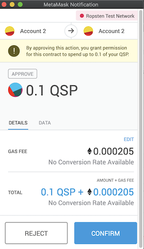

    1. Click on the `View your transaction` button that appears next to the `Write` button. Make sure that your transaction is confirmed on the blockchain before starting the next step. 
    
        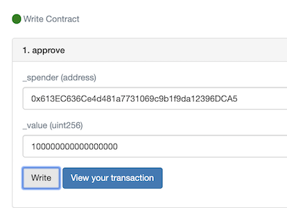
        
*Troubleshooting Tip: If your transaction is taking too long to get confirmed on the blockchain, try using the MetaMask's* `speed up` *feature. In MetaMask, click on your pending transaction in the Queue section and select* `speed up`.

   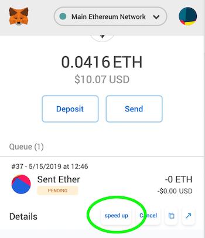

#### Tell the `[The Protocol Contract]` to freeze and stake the funds

**Attention!:** In the previous section, we interacted with the `[QSP Token Contract]`. In order to complete the staking process, we will now make a transaction on a *different contract*, the `[The Protocol Contract]`. 

1. [Click here](https://s3.amazonaws.com/qsp-protocol-contract/mainnet/QuantstampAudit-v-2-meta.json) to view the current address of `[The Protocol Contract]` and then insert that address into [Etherscan.io](Etherscan.io). 
1. Navigate to the `Write Contract` tab.
1. (Since already connected in the step above, this is likely not the case and you may skip it!) If there is a `Connect with Metamask` link next to the text "Write Contract", click it. Approve its request to connect to Metamask. Then, you should see a green circle next to the write contract after you connected Etherscan.io to MetaMask.
1. Stake the funds to `[The Protocol Contract]`:
    1. Navigate to the `stake` function
    1. Fill the field amount with `[QSP Staking Amount]` 
        1. The current minimum amount of QSP that needs to be staked is 50,000
        1. The QSP needs to be staked using the wei denomination. 50000 QSP in the wei denomination is 50000000000000000000000 (which is 50,000 multiplied by 10^18)
    1. Click the `Write` button, and then confirm the Metamask transaction. *Make sure the transaction is confirmed on the blockchain before proceeding to the next step.* 
    
    
### Set the minimum audit price
You can set a minimum audit price as a configuration parameter. This is the minimum price in QSP for which your node will be willing to perform a scan of a smart contract submitted to the Quantstamp Protocol.

Open `resources/config.yaml`. The resources folder is located within your qsp node directory (folder). Your qsp node directory was extracted from a zip file in step 1.  

Search for `min_price_in_qsp` and change the value accordingly. Make sure that you do not change anything else in this file, including indentation.

The default setting `min_price_in_qsp: !!int 1000` indicates that the node will not execute any audit request if the reward is less than 1,000 QSP. If you wished to increase this amount to 50,000 QSP,
you would need to change the line to `min_price_in_qsp: !!int 50000`.

*Troubleshooting Tip: If you are updating `min_price_in_qsp`, make sure that you update this parameter for `mainnet` and not `testnet`.* 

## Running the Node
In a terminal, open the directory of the qsp-protocol package you downloaded and unzipped at the beginning of this guide.

### Setting up your local machine configuration for every new Terminal opened

You need to set two environment variables for the node to connect to the Infura API, and to send transactions from your Ethereum account. Open `Terminal` and enter the following two commands (single quotes is to handle special characters):

- `export QSP_ETH_AUTH_TOKEN='[Infura Token]'`
- `export QSP_ETH_PASSPHRASE='[MyEtherWallet Password]'`

If you close your terminal you will have to set these variables again before starting another node instance. 

### Run the Node!
In order to run the audit node container, Docker must be running. Check whether the docker daemon
is up and running (`ps -A | egrep docker`). If not running, please start it.

### Run
From within the bundle directory, you can either run the node in the foreground using the following command:

`./bin/start-node`

Or run the node in the background(detached mode) using the following command:

`nohup ./bin/start-node &`

### View Logs

Logs are written to `qsp-protocol-node.log` file in .qsp-protocol directory within the user home directory.

### Stop
To stop the node, open a new terminal in the bundle directory and issue the following command:

`./bin/stop-node`

This will stop and remove the Docker containers.

### To use non production environment
Node can be run against non-prod environment by setting `QSP_ENV`  variable to `testnet` in ./bin/start-node file

### Check if your node runs correctly
1. Go to protocol.quantstamp.com 
1. Check if your `[Ethereum public address]` is in the `QSP Nodes` panel

    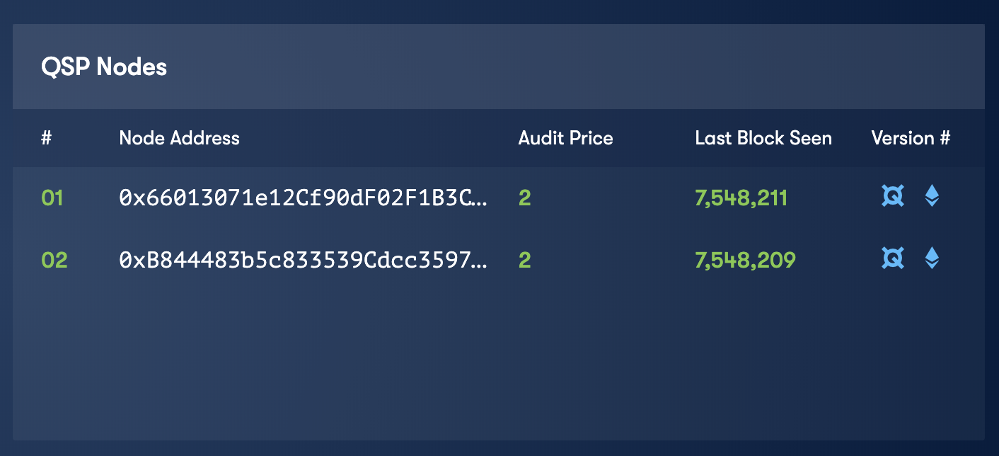

## After running the node for a while
### Checking how much QSP is in your account
Navigate to https://etherscan.io/address/[MyEtherWallet PublicKey]. You can locate this information in the Overview panel.  

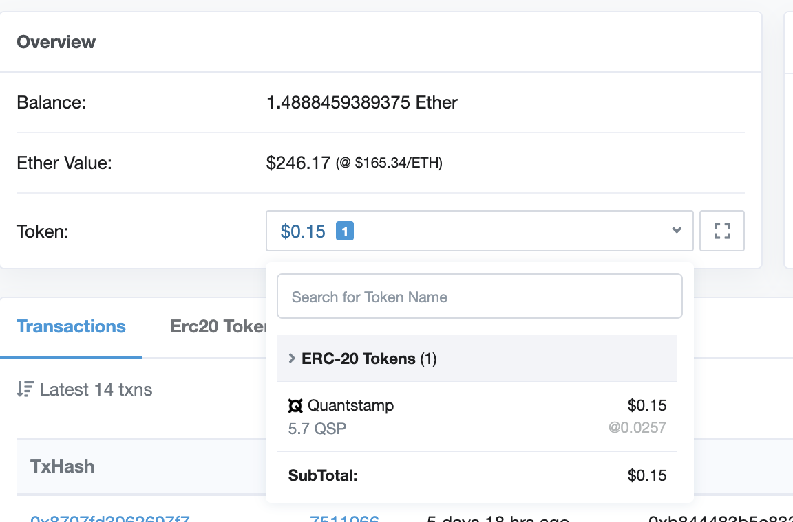

### How to unstake your funds (Warning: not eligible to run more scans) 
When you decide to stop operating a Quantstamp Protocol node, you might want to unstake the funds so that they are returned to the node's account. Here are the steps to unstake your funds:

1. Find `[The Protocol Contract]` on the website Etherscan using the address of `[The Protocol Contract]`. [Click here](https://s3.amazonaws.com/qsp-protocol-contract/mainnet/QuantstampAudit-v-2-meta.json) to view the current address of `[The Protocol Contract]`. 
1. Navigate to the `Write Contract` tab
1. If there is `Connect with Metamask` next to the text "Write Contract", click it. If not, skip this step. Approve its request to connect to MetaMask. After you successfully connect to Etherscan, you will see a green circle next to "Write Contract".
1. Unstake the funds from `[The Protocol Contract]`:
    1. Navigate to the unstake function
    1. Click the `Write` Button

